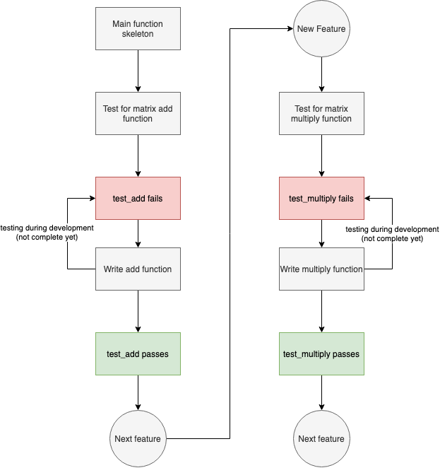

# Matrix Opertions Example - Testing with Python

Matrix operations Example used to explain test driven development in [this](https://medium.com/@sanjitunv/understanding-unit-testing-in-python-part-iii-f860d783f0ea) medium article.

## Flow of development

## Cycle TDD

